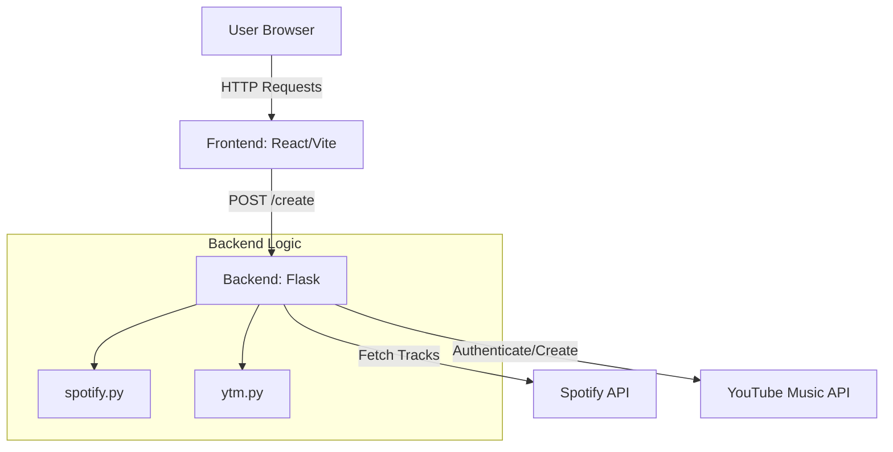

[🏠 Index](./README.md) | [Next ➡](./02-structure.md)

# Project Overview

SpotTransfer is a specialized web application designed to bridge the gap between Spotify and YouTube Music. It enables users to seamlessly migrate their music libraries by parsing Spotify playlist URLs and programmatically recreating those playlists within the YouTube Music ecosystem. The application handles the complexities of authentication, track matching, and playlist generation, providing a streamlined user interface for the migration process.

## Key Features and Capabilities

*   **Spotify Data Extraction:** Utilizes `backend/spotify.py` to interface with the Spotify API, extracting track metadata and playlist details from public URLs.
*   **YouTube Music Integration:** Leverages the `ytmusicapi` library in `backend/ytm.py` to authenticate users via HTTP headers and automate the creation of new playlists.
*   **Flexible Header Parsing:** Includes robust logic in `backend/ytm.py` to convert raw browser-copied headers into the structured format required by the YouTube Music API.
*   **Responsive Frontend:** Built with React, Vite, and TailwindCSS, providing a modern, accessible interface for inputting playlist URLs and managing the transfer process.
*   **Playlist Validation:** Implements client-side validation in `frontend/src/components/create-playlist/input-fields.tsx` to ensure URL integrity before processing.

## Technology Stack

### Backend
*   **Language:** Python 3.x
*   **Framework:** Flask
*   **Key Libraries:** `ytmusicapi`, `requests`, `python-dotenv`, `gunicorn`
*   **Entry Point:** `backend/main.py`

### Frontend
*   **Language:** TypeScript
*   **Framework:** React
*   **Build Tool:** Vite
*   **Styling:** TailwindCSS, `tailwindcss-animate`
*   **UI Components:** Radix UI primitives

## High-Level Architecture

The application follows a client-server architecture where the React frontend communicates with a Flask API backend. The backend acts as an orchestrator, fetching data from Spotify and pushing it to YouTube Music.

## Core Components

### Backend Modules
The backend logic is modularized to separate concerns between data retrieval and platform interaction:

*   `backend/main.py`: Defines the Flask application routes, specifically the `/create` endpoint which triggers the playlist migration workflow.
*   `backend/spotify.py`: Contains functions like `get_all_tracks(link, market)` and `get_playlist_name(link)` to handle Spotify data ingestion.
*   `backend/ytm.py`: Manages YouTube Music interactions, including `parse_headers(headers_text)` for authentication and `create_ytm_playlist(playlist_link, headers)` for execution.

### Frontend Components
The frontend is structured to provide a guided user experience:

*   `frontend/src/pages/create-playlist.tsx`: The primary view for the migration workflow.
*   `frontend/src/components/create-playlist/input-fields.tsx`: Manages user input, URL validation, and the `testConnection()` and `clonePlaylist()` functions.
*   `frontend/src/components/create-playlist/get-headers.tsx`: Provides instructions and UI for users to extract the necessary authentication headers from their browser.

## Configuration Parameters

The application requires specific environment variables to function. These should be configured in the `.env` files located in the `backend/` and `frontend/` directories.

| Variable | Location | Description |
| :--- | :--- | :--- |
| `SPOTIPY_CLIENT_ID` | `backend/.env` | The Client ID obtained from the Spotify Developer Dashboard. |
| `SPOTIPY_CLIENT_SECRET` | `backend/.env` | The Client Secret obtained from the Spotify Developer Dashboard. |
| `VITE_API_URL` | `frontend/.env` | The base URL of the Flask backend (e.g., `http://localhost:8080`). |

## Quick Links

*   **[Backend Setup](backend/README.md)**: Instructions for configuring the Flask environment and dependencies.
*   **[Frontend Development](frontend/README.md)**: Guide for running the React development server and building the production assets.
*   **[API Reference](backend/main.py)**: Documentation for the available Flask routes and request payloads.

[🏠 Index](./README.md) | [Next ➡](./02-structure.md)