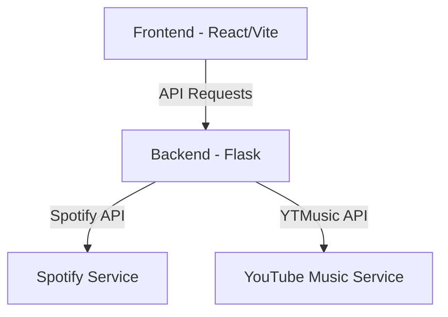

[⬅ Previous](./01-overview.md) | [🏠 Index](./README.md) | [Next ➡](./03-setup.md)

# Project Structure

SpotTransfer is organized as a monorepo containing a Python-based Flask backend and a React/TypeScript frontend. The architecture separates the presentation layer (Frontend) from the service and integration layer (Backend).

## Directory Tree

```text
SpotTransfer/
├── backend/
│   ├── config/
│   │   └── gunicorn.conf.py
│   ├── .env.example
│   ├── .gitignore
│   ├── header_auth.json
│   ├── main.py
│   ├── requirements.txt
│   ├── selfhost.py
│   ├── spotify.py
│   └── ytm.py
├── frontend/
│   ├── public/
│   │   └── favicon.png
│   ├── src/
│   │   ├── assets/
│   │   ├── components/
│   │   │   ├── create-playlist/
│   │   │   ├── landing/
│   │   │   └── ui/
│   │   ├── context/
│   │   ├── lib/
│   │   ├── pages/
│   │   ├── index.css
│   │   ├── main.tsx
│   │   ├── nav-bar.tsx
│   │   └── vite-env.d.ts
│   ├── .env.example
│   ├── .gitignore
│   ├── components.json
│   ├── eslint.config.js
│   ├── index.html
│   ├── package.json
│   ├── pnpm-lock.yaml
│   ├── postcss.config.js
│   ├── tailwind.config.js
│   ├── tsconfig.app.json
│   ├── tsconfig.json
│   ├── tsconfig.node.json
│   ├── vercel.json
│   └── vite.config.ts
├── .gitignore
├── LICENSE
└── README.md
```

## Architecture Overview

The application follows a client-server architecture where the React frontend communicates with the Flask backend via RESTful API endpoints.



## Directory Descriptions

| Directory | Purpose |
| :--- | :--- |
| `backend/` | Contains the Flask application, API routes, and integration logic for Spotify and YouTube Music. |
| `backend/config/` | Stores server-side configuration files, such as `gunicorn.conf.py`. |
| `frontend/` | Contains the React application built with Vite and Tailwind CSS. |
| `frontend/src/components/` | Reusable UI components, including shadcn/ui primitives and feature-specific components. |
| `frontend/src/pages/` | Route-level components that define the application views (e.g., `App.tsx`, `create-playlist.tsx`). |
| `frontend/src/context/` | Global state management, specifically `playlist-context.tsx` for handling playlist data. |
| `frontend/src/lib/` | Utility functions, such as `utils.ts` which provides the `cn` helper for Tailwind class merging. |

## Key Files and Roles

### Backend
*   `backend/main.py`: The entry point for the Flask application. Defines the API routes, including `/create` for playlist generation and `/` for the home endpoint.
*   `backend/spotify.py`: Contains logic for interacting with the Spotify API, including token retrieval, playlist ID extraction, and track fetching.
*   `backend/ytm.py`: Handles YouTube Music integration, including parsing user headers and creating playlists via `ytmusicapi`.
*   `backend/selfhost.py`: Provides utilities for self-hosting the application and managing local playlist creation workflows.

### Frontend
*   `frontend/src/main.tsx`: The application entry point. Configures the `BrowserRouter`, `PlaylistProvider`, and `ThemeProvider`.
*   `frontend/src/components/ui/`: Contains atomic UI components (e.g., `button.tsx`, `input.tsx`, `card.tsx`) used throughout the application.
*   `frontend/src/components/create-playlist/`: Contains logic specific to the playlist creation workflow, such as `get-headers.tsx` and `input-fields.tsx`.
*   `frontend/tailwind.config.js`: Defines the Tailwind CSS configuration, including custom theme extensions, colors, and animation settings.
*   `frontend/vite.config.ts`: Configures the Vite build tool, including path aliases (e.g., `@` mapping to `./src`).

## Logical Organization

The codebase is organized into three distinct layers:

1.  **Presentation Layer (`frontend/src/pages/` & `components/`):** Responsible for rendering the user interface, handling user input, and managing local UI state. It uses React Router for navigation and Context API for global state.
2.  **API/Controller Layer (`backend/main.py`):** Acts as the interface between the frontend and the service layer. It handles HTTP requests, validates input, and returns JSON responses.
3.  **Service/Integration Layer (`backend/spotify.py` & `backend/ytm.py`):** Encapsulates the business logic and external API interactions. This layer is decoupled from the web framework, allowing for easier testing and maintenance of the integration logic.

[⬅ Previous](./01-overview.md) | [🏠 Index](./README.md) | [Next ➡](./03-setup.md)