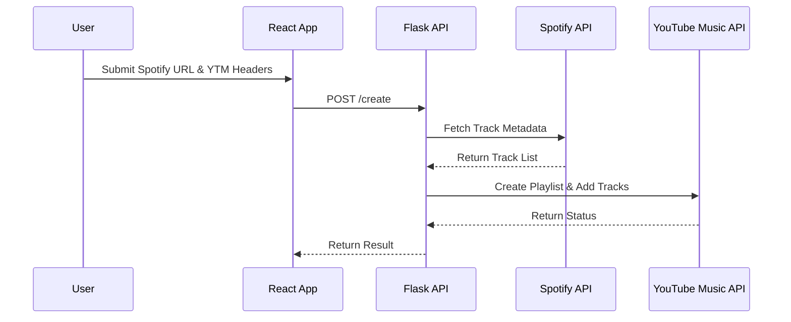

[⬅ Previous](./03-setup.md) | [🏠 Index](./README.md) | [Next ➡](./05-deployment.md)

# API Reference

This document details the API endpoints, internal module interfaces, and client-side integration logic for the SpotTransfer application. SpotTransfer utilizes a Flask-based backend to orchestrate data retrieval from the Spotify API and playlist creation via the YouTube Music API.

## Architecture Overview

The application follows a client-server architecture where the React frontend handles user input and authentication header parsing, while the Flask backend manages the heavy lifting of API communication.



## Backend API Endpoints

The backend is defined in `backend/main.py` and serves as the primary interface for the frontend.

### POST /create

Initiates the playlist transfer process. This endpoint parses the provided Spotify URL, fetches the track list, and creates a corresponding playlist on YouTube Music using the provided authentication headers.

**Request Body**

| Parameter | Type | Description |
| :--- | :--- | :--- |
| `playlist_url` | `string` | The full URL of the Spotify playlist. |
| `headers` | `string` | The raw HTTP headers string copied from the browser for YouTube Music authentication. |

**Example Request**

```json
{
  "playlist_url": "https://open.spotify.com/playlist/37i9dQZF1DXcBWIGoYBM5M",
  "headers": "user-agent: Mozilla/5.0...\ncontent-type: application/json..."
}
```

## Internal Module Interfaces

The backend logic is modularized into specific service files. These functions are invoked by the main Flask application.

### YouTube Music Service (`backend/ytm.py`)

This module handles interaction with the `ytmusicapi` library.

#### `parse_headers(headers_text: str)`
Converts raw header text (often copied from browser developer tools) into a dictionary format compatible with `ytmusicapi`.

*   **Input**: `headers_text` (Raw string)
*   **Returns**: `dict` (Formatted HTTP headers)

#### `create_ytm_playlist(playlist_link: str, headers: str)`
Orchestrates the creation of the playlist. It calls `spotify.get_all_tracks` to retrieve the source data and then iterates through the tracks to add them to the new YouTube Music playlist.

*   **Input**: `playlist_link` (str), `headers` (str)
*   **Returns**: `dict` (Status object containing success/failure and playlist ID)

### Spotify Service (`backend/spotify.py`)

This module handles data extraction from Spotify.

#### `get_all_tracks(link: str, market: str)`
Retrieves all track metadata from a given Spotify playlist URL.

*   **Input**: `link` (str), `market` (str, e.g., "US")
*   **Returns**: `list` (List of track objects containing title and artist)

#### `get_playlist_name(link: str)`
Extracts the title of the Spotify playlist to use as the name for the new YouTube Music playlist.

*   **Input**: `link` (str)
*   **Returns**: `str` (Playlist title)

## Frontend Integration

The frontend, located in `frontend/src/`, interacts with the backend via the `InputFields` component.

### Client-Side Logic (`frontend/src/components/create-playlist/input-fields.tsx`)

The `InputFields` component manages the state of the user input and triggers the API calls.

#### `clonePlaylist()`
This function is triggered when the user submits the form. It performs the following steps:
1.  Validates the Spotify URL format using `validateUrl()`.
2.  Sends a `POST` request to the `/create` endpoint.
3.  Updates the UI state based on the response (success or error).

```typescript
// Example snippet from InputFields.tsx
const clonePlaylist = async () => {
    const response = await fetch('/create', {
        method: 'POST',
        headers: { 'Content-Type': 'application/json' },
        body: JSON.stringify({
            playlist_url: playlistUrl,
            headers: ytmHeaders
        })
    });
    const data = await response.json();
    // Handle response logic
};
```

#### `testConnection()`
A utility function used to verify that the provided YouTube Music headers are valid before attempting the full transfer. It performs a lightweight request to the YouTube Music API to check for authentication success.

## Troubleshooting

### Header Parsing Errors
If the `parse_headers` function fails, ensure the headers copied from the browser are in the correct format. The system supports:
*   **Standard format**: `header: value`
*   **Plain format**: `header\nvalue`

### CORS Issues
If the frontend cannot reach the backend, verify that `flask_cors` is correctly initialized in `backend/main.py`. Ensure the `CORS(app)` configuration allows requests from the origin where the Vite development server is running (typically `http://localhost:5173`).

### Spotify URL Format
The `spotify.extract_playlist_id` function expects standard Spotify playlist URLs. Ensure the URL does not contain extra query parameters that might interfere with the regex parsing logic.

---

### Why included

**Reason:** Architecture 'monolith' recommends this section

**Confidence:** 80%


**Evidence:**

- `backend\main.py`: API decorators: app.route

[⬅ Previous](./03-setup.md) | [🏠 Index](./README.md) | [Next ➡](./05-deployment.md)