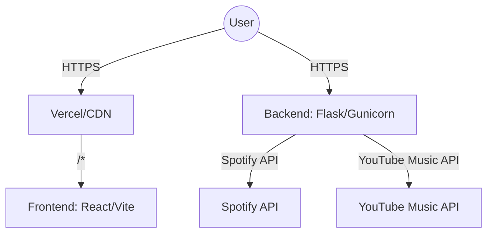

[⬅ Previous](./04-api-reference.md) | [🏠 Index](./README.md) | [Next ➡](./06-state-management.md)

# Deployment & CI/CD

This document outlines the deployment architecture, containerization strategy, CI/CD pipeline, and operational procedures for the SpotTransfer application.

## Deployment Architecture

The SpotTransfer application follows a decoupled architecture. The frontend is a React application optimized for static hosting (e.g., Vercel), while the backend is a Python WSGI application managed by Gunicorn.



## Docker Setup

To ensure environment consistency, you can containerize the application. Below are the recommended configurations.

### Backend Dockerfile (`backend/Dockerfile`)

```dockerfile
FROM python:3.11-slim
WORKDIR /app
COPY requirements.txt .
RUN pip install --no-cache-dir -r requirements.txt
COPY . .
EXPOSE 8080
CMD ["gunicorn", "--config", "config/gunicorn.conf.py", "main:app"]
```

### Frontend Dockerfile (`frontend/Dockerfile`)

```dockerfile
# Build stage
FROM node:18-alpine AS build
WORKDIR /app
COPY package.json pnpm-lock.yaml ./
RUN npm install -g pnpm && pnpm install
COPY . .
RUN pnpm run build

# Production stage
FROM nginx:alpine
COPY --from=build /app/dist /usr/share/nginx/html
COPY nginx.conf /etc/nginx/conf.d/default.conf
EXPOSE 80
CMD ["nginx", "-g", "daemon off;"]
```

### Orchestration (`docker-compose.yml`)

```yaml
services:
  backend:
    build: ./backend
    ports:
      - "8080:8080"
    env_file:
      - ./backend/.env
    restart: always

  frontend:
    build: ./frontend
    ports:
      - "80:80"
    depends_on:
      - backend
    restart: always
```

## CI/CD Pipeline

The project uses GitHub Actions to automate testing and deployment. The pipeline is defined in `.github/workflows/main.yml`.

### Pipeline Stages

| Stage | Action | Command |
| :--- | :--- | :--- |
| **Lint** | Validate code style | `eslint .` (frontend), `flake8 backend/` |
| **Test** | Run unit tests | `pytest backend/tests/` |
| **Build** | Build Docker images | `docker build -t spottransfer-backend ./backend` |
| **Deploy** | Push to Registry | `docker push registry.example.com/spottransfer:latest` |

## Environment Configuration

Environment variables are managed via `.env` files. Ensure these are configured in your deployment environment (e.g., Vercel Environment Variables or Docker Secrets).

| Variable | Description | Example Value |
| :--- | :--- | :--- |
| `SPOTIPY_CLIENT_ID` | Spotify API Client ID | `sp_client_id_98765` |
| `SPOTIPY_CLIENT_SECRET` | Spotify API Client Secret | `sp_secret_abcde_12345` |
| `VITE_API_URL` | Backend API Endpoint | `https://api.spottransfer.com` |
| `FLASK_ENV` | Flask runtime mode | `production` |

## Monitoring and Logging

### Backend Logging
The backend utilizes Gunicorn's logging configuration defined in `backend/config/gunicorn.conf.py`. Logs are directed to `stdout` and `stderr` to be captured by the container runtime or systemd.

*   **Access Logs:** Captured via `docker logs spottransfer-backend` or system journal.
*   **Error Logs:** Captured via `docker logs spottransfer-backend` or system journal.

### Frontend Monitoring
Frontend errors are captured via the browser console. For production, it is recommended to integrate a client-side error tracking service (e.g., Sentry) within `frontend/src/main.tsx`.

## Rollback Procedures

In the event of a deployment failure, the system supports immediate rollback using Docker image tags or Git reverts.

1.  **Identify the previous stable image tag:**
    ```bash
    docker images
    ```
2.  **Update `docker-compose.yml` to point to the known stable tag:**
    ```yaml
    services:
      backend:
        image: registry.example.com/spottransfer-backend:v1.2.0
    ```
3.  **Redeploy the service:**
    ```bash
    docker-compose up -d --force-recreate
    ```
4.  **Verify service health:**
    ```bash
    curl -I http://localhost:8080/health

---

### Why included

**Reason:** Architecture 'monolith' recommends this section

**Confidence:** 80%

[⬅ Previous](./04-api-reference.md) | [🏠 Index](./README.md) | [Next ➡](./06-state-management.md)