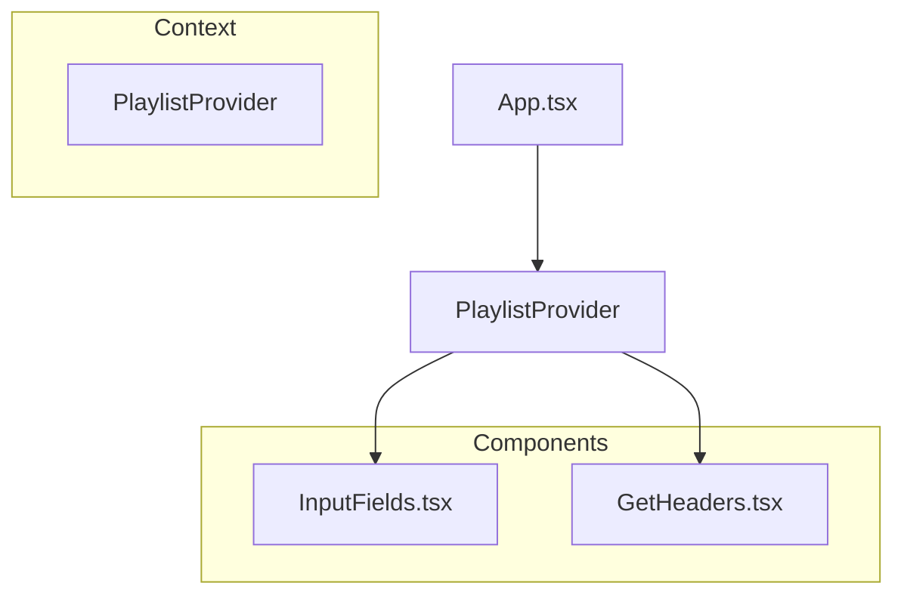

[⬅ Previous](./05-deployment.md) | [🏠 Index](./README.md)

# State Management

The SpotTransfer frontend utilizes React's Context API to manage global state, specifically for handling playlist data, user authentication headers, and input validation across the application. This architecture ensures that sensitive configuration data and playlist metadata remain accessible to deeply nested components without the need for prop drilling.

## Architecture Overview

The state management layer is centralized in `frontend/src/context/playlist-context.tsx`. This provider wraps the application tree, exposing a unified interface for components to read and update the current playlist configuration.

The following diagram illustrates the relationship between the `PlaylistProvider` and the consuming components:



## Playlist Context

The `PlaylistProvider` serves as the single source of truth for the playlist transfer process. It maintains the state of the source URL, destination headers, and validation status.

### File: `frontend/src/context/playlist-context.tsx`

The context is initialized using `createContext` and consumed via the `usePlaylist` hook.

```typescript
// Example usage of the context hook
const { playlistData, setPlaylistData } = usePlaylist();
```

| Property | Type | Description |
| :--- | :--- | :--- |
| `playlistData` | `Object` | Contains the current state of the playlist URL and associated metadata. |
| `setPlaylistData` | `Function` | State setter to update the playlist configuration. |

## Input Management

The `InputFields` component acts as the primary interface for user interaction. It consumes the `PlaylistContext` to synchronize user input with the global state.

### File: `frontend/src/components/create-playlist/input-fields.tsx`

This component handles the lifecycle of the playlist transfer request, from URL validation to the final API call.

#### Key Functions

*   **`validateUrl(url: string)`**: Performs regex-based validation on the provided Spotify or YouTube Music URL to ensure it conforms to expected patterns before submission.
*   **`handleUrlChange(e: React.ChangeEvent<HTMLInputElement>)`**: Updates the local state and triggers validation logic whenever the user modifies the input field.
*   **`testConnection()`**: Invokes the backend API to verify that the provided headers are valid and that the service can communicate with the target music platform.
*   **`clonePlaylist()`**: The primary execution function. It aggregates the state from the context and triggers the transfer process via the backend API.

### Implementation Example

The following snippet demonstrates how `InputFields` integrates with the context to manage the transfer state:

```tsx
import { usePlaylist } from '@/context/playlist-context';

export function InputFields() {
  const { playlistData, setPlaylistData } = usePlaylist();

  const handleUrlChange = (e: React.ChangeEvent<HTMLInputElement>) => {
    const newUrl = e.target.value;
    validateUrl(newUrl);
    setPlaylistData((prev) => ({ ...prev, url: newUrl }));
  };

  return (
    <div className="input-container">
      <Input 
        value={playlistData.url} 
        onChange={handleUrlChange} 
        placeholder="Paste playlist URL here..." 
      />
      <Button onClick={clonePlaylist}>Start Transfer</Button>
    </div>
  );
}
```

## Troubleshooting

If state updates are not reflecting in the UI or API calls are failing, verify the following:

1.  **Provider Wrapping**: Ensure that `PlaylistProvider` is wrapping the component tree in `frontend/src/pages/App.tsx`. If the component is outside the provider, `usePlaylist()` will return `undefined`.
2.  **State Immutability**: When updating `playlistData`, always use the functional update pattern (`setPlaylistData(prev => ({...prev, ...}))`) to ensure React detects the state change correctly.
3.  **Validation Errors**: If `clonePlaylist` fails, check the console for validation errors triggered by `validateUrl`. Ensure the URL format matches the requirements defined in the backend `spotify.py` or `ytm.py` modules.

---

### Why included

**Reason:** The application relies on complex form handling and multi-step playlist creation. Understanding the state flow is essential for developers modifying the UI or adding new playlist creation steps.

**Confidence:** 75%


**Evidence:**

- `frontend/src/context/playlist-context.tsx`: frontend/src/context/playlist-context.tsx

- `frontend/src/components/create-playlist/input-fields.tsx`: frontend/src/components/create-playlist/input-fields.tsx

[⬅ Previous](./05-deployment.md) | [🏠 Index](./README.md)